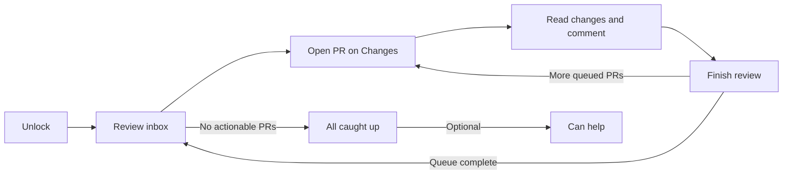

# Bitbucket Review Workspace — Product and Design Guide

**Status:** Recovered and consolidated design direction
**Last updated:** 2026-09-10
**Product phase:** UX discovery complete; suitable for architecture integration and phased implementation planning
**Visual direction:** Workbench Graphite

## 1. Product definition

This product is a personal, single-user review workspace for Bitbucket Cloud. It is a static web application/PWA that can be served publicly, locally, or inside a company network. It has no product accounts and no backend.

Its central promise is simple:

> Open one trustworthy inbox, review the PRs that genuinely need you, finish them, and continue until you are caught up.

The browser calls Bitbucket Cloud directly using a token supplied by the user. Actions appear as that Bitbucket user. Product state remains local to the browser unless the user explicitly exports an encrypted backup in a later phase.

### North-star outcome

The user trusts that:

- every genuine review obligation is visible;
- every PR explains why it is present;
- finishing a review removes it;
- a meaningful new event brings it back;
- filters and smart rules never silently lose work.

## 2. Fixed product constraints

### Included

- Bitbucket Cloud only in v1.
- Direct browser-to-Bitbucket API communication.
- User-supplied Bitbucket API token.
- Passkey-protected encrypted local credential storage using WebAuthn PRF when supported.
- Passphrase-encrypted storage as the fallback.
- Session-only credential mode.
- Cross-repository personal review inbox.
- Full-page code review using `@pierre/diffs` / diffs.com.
- Inline and general comments.
- Approve, Request changes, and Reviewed without status outcomes, subject to token scopes.
- Light and dark appearance.
- Complete keyboard operation.

### Excluded from v1

- Product accounts or a separate identity system.
- Team or shared product state.
- Backend services or server-side storage.
- Analytics or telemetry.
- AI calls or AI-based prioritization.
- Runtime CDNs and third-party scripts.
- Automatic cloud synchronization.
- Stacked pull-request workflows.
- GitHub or GitLab support.
- A provider plugin framework.

Keep a narrow provider boundary so another provider can be added later, but do not expose or build a general plugin system.

## 3. Experience principles

1. **Changes first.** Code receives the most space and visual weight.
2. **Trust before cleverness.** Reasons, ordering, stale state, and limitations remain visible.
3. **Compact and useful.** Small paddings, short labels, dense rows, and restrained chrome.
4. **Developer-native.** Text queries, keyboard control, command palette, and monospace metadata feel familiar without imitating an IDE.
5. **One inbox, not another feed.** The primary count represents actionable review work.
6. **Intelligence is explainable.** Rules use visible deterministic conditions, not hidden scores.
7. **Safe degradation.** Partial data and read-only operation stay useful without pretending to be complete.
8. **No ornamental complexity.** Avoid dashboards, cards, animations, and settings that do not help review work.

## 4. Information architecture

The product has four main surfaces:

1. **Connect / unlock** — credential entry, validation, storage choice, and capability summary.
2. **Review inbox** — actionable PRs, search, quick filters, saved rules, optional groups, refresh state, and completion suggestions.
3. **Review workspace** — Overview and Changes tabs, diffs, file navigation, comments, queue access, and Finish review.
4. **Settings** — credentials, repositories, rules, appearance, review preferences, and local-data controls.

The default destination after unlocking is the inbox. Opening a PR from the inbox lands on **Changes**.

## 5. Core journey



When a review session begins, its order is based on the visible inbox order. New arrivals do not interrupt the active sequence. After the final queued PR is finished, the product returns to the inbox.

## 6. Connect and unlock

### First run

1. Explain in one sentence that the token stays encrypted on this device and requests go directly to Bitbucket.
2. Accept the token without echoing the complete value after entry.
3. Validate identity, accessible repositories, and available capabilities.
4. Show a compact capability summary:
   - Read pull requests
   - Comment
   - Approve
   - Request changes, when distinguishable
5. If write scopes are missing, continue in read-only mode.
6. Offer storage modes:
   - Use passkey
   - Use passphrase
   - This session only
7. Include all accessible repositories by default.
8. Load the inbox progressively; repository exclusions live in Settings.

### Returning visit

- Passkey and passphrase modes require their corresponding unlock interaction.
- Session-only mode requires the token again after the session ends.
- Local rules and non-secret preferences may render before the network refresh.
- An expired token does not destroy local rules or review state.

## 7. Actionable inbox model

### Initial inclusion

An open PR enters the actionable inbox when at least one condition is true:

- The user is explicitly requested as a reviewer.
- The user is directly involved through an `@mention` or meaningful discussion participation.

General repository activity, another reviewer's approval, and unrelated comments do not make a PR actionable.

### Removal

After a confirmed successful Finish review, the PR immediately leaves the inbox. The client records the reviewed commit and the relevant conversation position.

Merged, declined, deleted, and inaccessible PRs also leave after refresh. When local context is available, the product may explain the removal in recent activity.

### Re-entry

A finished PR returns when:

- a new source commit is added;
- the user receives a renewed review request;
- someone directly replies in a thread the user participated in;
- someone `@mentions` the user;
- a thread created by the user is reopened.

Unrelated comments and generic PR activity do not requeue it.

### Explainability contract

Every actionable row shows one primary reason:

- Review requested
- Replied to you
- Mentioned you
- Thread reopened
- New commits
- Review requested again

This reason is both an explanation and an ordering signal.

## 8. Inbox layout

### Default state: flat list

The default inbox is a single compact list. There are no groups until the user creates a saved rule with a grouping effect.

Each row contains:

- Repository and PR number
- PR title
- Author
- Why it needs attention
- Waiting age or relevant-event age
- Compact change size
- CI icon

Rows use horizontal separators rather than cards. The title is visually dominant; repository, author, age, and size are quieter.

### Default ordering

Without saved rules, order by reason and then age:

1. Direct replies, mentions, reopened user-created threads, and renewed requests
2. New commits after a finished review
3. Ordinary review requests

Within each category, oldest waiting work appears first.

### Grouped state

Groups appear only when a saved query uses **Create named group**.

A group header contains:

- Group name
- Item count
- Optional compact rule expression
- Slim accent rail or quiet tinted strip

The group does not become a card. PR rows retain the same structure and density as the flat list. Unmatched actionable PRs remain visible in an **Other requests** section.

Example:

```text
My team first · 3                         team:payments sort:updated
  checkout/api      Move confirmation…   requested you   18m   ✓
  payments/core     Guard callbacks…     team request    44m   ✓

Returned after review · 2                has:new-commits OR has:reply
  atlas/api         Normalize retries…   new commits      3h   ✓
```

### Row focus

- Keyboard focus uses a quiet surface tint and a 2px cobalt leading rail.
- Focus never relies only on color.
- The focused row remains visible when background refresh changes nearby rows.
- Background refresh must not steal focus.

## 9. Search, quick filters, and smart rules

### One shared query language

Search, quick filters, rules, groups, and completion suggestions share one GitHub-like text syntax. The product follows the familiar mental model without promising complete GitHub compatibility.

Representative queries:

```text
review-requested:@me -is:draft
author:@bob review:approved
team:"Payments" reason:new-commits
ci:failure age:>3d
repo:connect-backend involves:@me
```

Initial qualifier families:

- Identity: `author:`, `reviewer:`, `review-requested:`, `reviewed-by:`, `involves:`, `team:`
- Location: `workspace:`, `repo:`
- Review state: `review:`, `reason:`, `is:`
- Delivery state: `ci:`
- Triage: `age:`, `size:`

### Authoring behavior

- Qualifier names autocomplete.
- Values autocomplete after `:`.
- People, teams, repositories, and enum variants are offered where available.
- Quoted values support spaces.
- Leading `-` excludes.
- Spaces mean AND.
- Invalid terms receive an inline correction without clearing the query.
- The whole interaction works from the keyboard.

### Quick filters

Compact initial quick filters:

- Requested
- Direct
- New commits
- CI failed

Quick filters insert and remove terms in the query field. The query field is the source of truth; filters are not a second state system.

Temporary filtering may narrow the visible list, but the interface always distinguishes **matching** from **total actionable** work.

### Saved effects

Saving a query offers exactly one effect:

1. **Prioritize matches** — reorder without grouping.
2. **Create named group** — add a visible section.
3. **Suggest when caught up** — populate only the optional Can help area.

Rules may reorder or group actionable items. They must not permanently hide them.

## 10. CI presentation

CI uses icons without adjacent status words:

- Green check: passed
- Red failure mark: failed
- Neutral progress indicator: pending
- Neutral unavailable mark: unknown or unavailable

Each icon has an accessible name and tooltip. Opening a failed status reveals only failed step names, for example:

```text
RSpec · shard 4
Lint
```

Verbose logs stay outside the inbox.

## 11. Review workspace

### Priority hierarchy

1. Extremely thin top bar
2. Compact Overview and Changes tabs
3. File navigation and dominant review content
4. Hidden-by-default review queue drawer

The top bar contains only:

- Return to inbox
- Compact PR identity/title
- Queue control with remaining count
- Finish review

Repository branding and secondary metadata must not compete with code.

### Changes — default tab

Opening an inbox item lands on Changes.

Changes contains:

- Compact commit comparison selector
- File tree
- Unified or split diff
- Explicit Viewed controls
- Inline discussions and draft comments
- Compact diff preferences

`@pierre/diffs` / diffs.com exclusively owns code presentation, including syntax, gutters, line rendering, split/unified behavior, and code annotations. Workbench Graphite styles the surrounding product shell, not the code renderer.

Wide screens default to split diff. Narrow screens default to unified diff. A manual choice is remembered.

### Commit comparison

The selector inside Changes offers:

- All changes
- Since your last finished review, when available
- Individual commit or commit range

First-time reviews default to All changes. A PR requeued because of new commits defaults to Since your last finished review.

### Overview

Overview combines:

- Full Markdown description
- Author and branch relationship
- Reviewers and current states
- General comments
- Review activity
- Commit and review events
- Relevant linked Bitbucket items

Description and activity belong in the Overview tab, not in the queue drawer or a permanent side panel.

### File navigation and progress

- File tree is compact and collapsible.
- Every file has an explicit Viewed control.
- New commits reset Viewed only for affected files.
- Progress is viewed files over total files.
- Scrolling never implies that a file was reviewed.

### Comments

- Inline and general comments are drafted locally by default.
- Drafts remain private until Finish review.
- Each draft offers Send now.
- Pending-comment count stays visible near Finish review.
- Users can navigate unresolved, resolved, outdated, and pending threads.
- Failed submission preserves draft text, selected lines, and the intended action.

### Review queue drawer

- Hidden by default.
- Opens from the compact Queue control.
- Overlays or temporarily compresses the diff.
- Shows the current PR and upcoming PRs with reason and age.
- Allows switching directly to another queued PR.
- Closing it restores maximum diff width.
- It contains queue navigation only, not description or activity.

### Finish review

Finish review opens a compact confirmation surface containing:

- Pending inline and general comment summary
- Optional overall comment
- Approve
- Request changes
- Reviewed without status

Unavailable outcomes remain visible but disabled, with the missing permission explained.

After a successful finish:

1. Remove the PR from the actionable inbox.
2. Open the next PR in the active review order.
3. When no PR remains, return to the inbox.

A failure keeps the user on the current PR, preserves all drafts, and never advances.

The exact single-key shortcut behavior for Finish review is intentionally deferred.

## 12. Keyboard model

The entire core workflow must be usable without a mouse.

### Approved conventions

| Key | Behavior |
|---|---|
| `↑` / `↓` | Move through inbox, queue, menus, and suggestions |
| `Enter` | Open or activate focused item |
| `Esc` | Close overlay or return to the previous surface |
| `/` | Focus inbox search |
| `Cmd/Ctrl + K` | Open command palette |
| `Tab` / `Shift + Tab` | Move through interactive controls |
| `O` | Open Overview when not typing |
| `C` | Open Changes when not typing |
| `Q` | Open review queue when not typing |
| `?` | Open shortcut reference |

There are no Vim-style bindings.

### Shortcut presentation

- Important actions show quiet, low-contrast keycaps beside their labels.
- The command palette shows shortcuts right-aligned.
- A compact contextual hint strip may appear at the bottom of dense work surfaces.
- Nonessential hints are hidden on touch-only devices.
- Global single-key shortcuts pause while the user types in search, comments, or another editable control.
- Focus stays clearly visible in both themes.

## 13. Completion experience

### All caught up

After the final actionable PR is finished, show:

- **All caught up**
- Last confirmed refresh time
- Manual refresh
- Compact recently finished reviews

The state should feel calm and final, not like an empty dashboard template.

### Can help

If other open PRs exist, show a separate optional Can help section below the completion state.

Suggestions:

- never increase the actionable inbox count;
- never block the All caught up state;
- always state a deterministic reason;
- use a small set of built-in criteria plus saved suggestion queries;
- contain no hidden score or AI inference.

Possible criteria:

- Fewer than the required approvals
- Repeated rebases or updates without sufficient review
- CI passing and otherwise close to merge
- Aging without reviewer activity
- Matching an explicit Suggest when caught up rule

Opening a suggestion does not automatically convert it into an obligation.

## 14. Loading, refresh, and degraded states

### Initial loading

- Render shell and saved preferences immediately.
- Use compact row skeletons, not a full-page spinner.
- Load repositories progressively.
- Show quiet repository progress.
- Allow interaction with repositories already loaded.

### Refresh

Refresh on:

- launch;
- app focus;
- completed review actions;
- a reasonable visible-app interval;
- manual request.

Always show a quiet last-updated time. Background refresh does not replace the whole list or steal focus.

### Partial failure

- Keep successful repository results usable.
- Mark the overall view as partial.
- List affected repositories in one compact warning.
- Retry failed repositories only.
- Never show All caught up while included repositories remain unresolved.

### Stale or offline snapshot

- Keep the last snapshot visible.
- Show when it was confirmed.
- Permit cached reading where data exists.
- Disable writes.
- Restore actions only after connectivity is confirmed.
- Do not queue offline review submissions in v1.

### Token rejected

- Preserve local rules, preferences, drafts, and non-secret review state.
- Explain that Bitbucket rejected the credential.
- Offer Replace token.
- Never display the stored token.

### Rate limited

- Preserve the last snapshot.
- Show next safe retry time when available.
- Pause automatic retries until allowed.
- Avoid repeated manual failures.

### Outdated comment target

Preserve the draft and offer:

- Re-anchor
- Post as general comment
- Discard

## 15. Workbench Graphite visual system

Workbench Graphite is a compact developer-tool shell. It borrows the calm hierarchy of modern developer SaaS products without copying their branding.

### Character

- Precise, quiet, and utilitarian
- Dense but not cramped
- Minimal ornament
- Neutral surfaces with one restrained focus accent
- More like a workbench than a project-management dashboard

### Color palette

| Role | Light | Dark |
|---|---|---|
| Canvas | `#F7F7F5` | `#111316` |
| Primary surface | `#FDFDFC` | `#171A1F` |
| Subtle surface | `#F1F2EF` | `#15181C` |
| Primary text | `#1F2329` | `#EFF1F4` |
| Secondary text | `#747B86` | `#9299A5` |
| Divider | `#DEDFDD` | `#292D34` |
| Focus accent | `#5674C9` | `#7895EA` |
| Success | `#247247` | `#69CF8D` |
| Failure | `#B4463D` | `#F08078` |

Theme selection lives in Settings with **System**, **Light**, and **Dark**. System is the default.

### Typography

- Use a neutral UI sans-serif for titles, labels, comments, and prose.
- Use a system monospace face for repository paths, queries, counts, ages, change sizes, rule expressions, and keycaps.
- Use regular and medium weights only.
- Keep titles modest; code and content should dominate the page.

### Density

- App bar: approximately 36–40px high.
- Inbox rows: approximately 40–44px on fine pointers.
- Compact controls: approximately 26–32px high.
- Main spacing rhythm: 4, 8, 12, 16, and 24px.
- Corner radii: 5–8px.
- Touch/coarse-pointer targets expand without making desktop density larger.

### Surfaces

- Use dividers for repeated rows, not cards.
- Use at most two primary background elevations.
- Use shadows only for overlays, drawers, menus, and the command palette.
- Avoid gradients, glass effects, glowing accents, and decorative borders.
- Group headers may use a subtle tint and slim accent rail.

### Motion

- Use 120–160ms transitions for focus, hover, drawers, and menus.
- Motion explains state changes; it does not decorate them.
- Never animate background refresh in a way that shifts attention.
- Honor reduced-motion preferences.

### Iconography

- Small, simple line icons.
- Icons support labels rather than replace unfamiliar actions.
- CI may be icon-only because shape, color, accessible name, and tooltip work together.
- Avoid colored icon backgrounds except when semantically necessary.

## 16. Component guidance

### App bar

- Thin, single row.
- Brand mark, location, global command entry, refresh, settings.
- Navigation recedes behind work content.

### Query bar

- Prominent enough to find, not taller than the surrounding compact controls.
- Monospace query text.
- `/` hint appears quietly at the trailing edge.
- Autocomplete never obscures the entire list.

### PR row

- One line on desktop when space permits.
- Clear column rhythm: repository, title, reason, author, age, CI.
- Title truncates last.
- Responsive layout removes secondary columns before forcing horizontal scroll.

### Group header

- One compact strip.
- Group name and count on the left.
- Optional rule expression on the right.
- Slim accent rail.
- Collapse is not required in the first version.

### Command palette

- Open with `Cmd/Ctrl + K`.
- Search commands in plain language.
- Arrow keys navigate; Enter executes; Esc closes.
- Shortcuts appear right-aligned.
- Commands reflect current capabilities and scope.

### Queue drawer

- Opens from the right.
- Does not permanently reduce diff width.
- Uses the same PR-row language in a narrower form.
- Restores focus to the trigger when closed.

### Finish review surface

- Compact and explicit.
- Keeps selected outcome and comment drafts if submission fails.
- Never removes the PR before Bitbucket confirms success.

## 17. Responsive behavior

- Desktop receives split or unified review.
- Narrow layouts default to unified diff.
- File tree and queue become overlay drawers.
- Inbox rows reflow without horizontal scrolling.
- Repository, author, and size may collapse before title, reason, age, and CI.
- Essential actions remain available without hover.
- Shortcut hints reduce on touch-only devices.

## 18. Accessibility requirements

- Default light and dark themes meet WCAG AA contrast requirements.
- Status never depends on color alone.
- Use semantic controls and landmarks.
- Keep focus visible everywhere.
- Preserve native Tab order.
- Announce refresh and action results without interrupting the user.
- Autocomplete, inbox, queue, file tree, comments, and review completion are keyboard-operable.
- Compact desktop UI still provides practical coarse-pointer targets.
- Reduced motion is supported.

## 19. Local state and backup

Device-local v1 state includes:

- Encrypted Bitbucket credential, unless session-only
- Repository exclusions
- Saved queries and rule effects
- Theme and diff preferences
- Last finished review commit/context
- Reviewed-without-status records
- Draft comments
- Recently finished reviews

Clearing browser data or changing device requires setup again.

A later phase may add encrypted backup to a user-selected file through the File System Access API where supported, with explicit encrypted export/import as fallback. This is user-controlled backup, not cloud sync.

## 20. Acceptance criteria

### Trust

- Every explicit request in an included accessible repository appears with a reason.
- Direct replies, mentions, reopened user-created threads, new commits, and renewed requests requeue finished PRs.
- Unrelated activity does not requeue.
- Smart rules cannot permanently hide actionable PRs.
- Partial or stale data cannot produce a false All caught up state.

### Triage

- Default inbox is flat and compact.
- Groups appear only when a saved rule creates them.
- Unmatched actionable PRs remain visible.
- Query field and quick filters stay synchronized.
- Ordering is explainable from reason, rules, and age.
- CI is compact, accessible, and wordless in the row.

### Review

- Inbox opens PRs on Changes.
- Requeued PRs can show changes since the last finished review.
- Viewed is explicit and resets only for affected files.
- Comments batch by default and can be sent individually.
- Successful Finish review advances through the active queue.
- The final item returns to the inbox.
- Failed Finish review preserves drafts and does not advance.

### Keyboard

- Core workflow works with standard keyboard controls.
- No Vim navigation is enabled.
- Shortcuts are discoverable through subtle keycaps and `?`.
- Global single-key actions pause during text entry.

### Degraded operation

- Read-only tokens can browse PRs and diffs.
- Repository failures do not erase successful results.
- Stale mode supports reading and disables writes.
- Replacing a token preserves non-secret configuration.

## 21. Delivery phases

### Phase 1 — Trustworthy read-only inbox

- Connect and unlock
- Capability validation
- Repository discovery and exclusions
- Actionable-event model
- Compact flat inbox
- Default ordering
- Search and basic quick filters
- Refresh, partial failure, and stale snapshot

### Phase 2 — Code-first review

- Overview and Changes tabs
- `@pierre/diffs` integration
- Adaptive split/unified rendering
- File tree and Viewed state
- Commit comparison selector
- Comment reading
- Queue drawer

### Phase 3 — Review actions and flow

- Draft comments and Send now
- Finish review outcomes
- Scope-aware disabled states
- Automatic next PR
- Re-entry detection
- Recently finished reviews

### Phase 4 — Personal intelligence

- Full qualifier autocomplete
- Saved priority rules
- Named groups
- Can help suggestions
- Refined keyboard and responsive PWA behavior

### Future

- Encrypted backup file
- Provider-boundary validation for GitHub/GitLab
- Stacked PR exploration

## 22. Deferred decisions

Only one interaction decision from discovery remains deliberately open:

- Exact single-key sequence and confirmation behavior for Finish review.

This does not block the information architecture, visual system, inbox, query model, or core review flow.

## 23. Visual references

- [Grouped inbox mockup](./mockups/grouped-inbox-workbench.html)
- [Keyboard workflow mockup](./mockups/keyboard-workbench-theme.html)

These mockups express the Workbench Graphite shell. They do not define or restyle the internals of the diffs.com code renderer.

## 24. Research references

- [Bitbucket Cloud — Review code in a pull request](https://support.atlassian.com/bitbucket-cloud/docs/review-code-in-a-pull-request/)
- [Bitbucket Cloud — Use pull requests for code review](https://support.atlassian.com/bitbucket-cloud/docs/use-pull-requests-for-code-review/)
- [Graphite — Pull Request Inbox](https://graphite.com/docs/use-pr-inbox)
- [Graphite — Review pull requests](https://graphite.com/docs/review-pull-requests)
- [GitHub — Filtering and searching issues and pull requests](https://docs.github.com/en/issues/tracking-your-work-with-issues/using-issues/filtering-and-searching-issues-and-pull-requests)
- [GitHub Primer — Color considerations](https://primer.style/accessibility/design-guidance/color-considerations/)
- [Linear — Code review should be fast](https://linear.app/now/code-review-should-be-fast)
- [Linear — A calmer interface for a product in motion](https://linear.app/now/behind-the-latest-design-refresh)
- [Raycast — New in v2](https://manual.raycast.com/new-in-v2)
- [`@pierre/diffs`](https://diffs.com/)

## 25. Final approved direction

- Personal, backend-free Bitbucket Cloud review workspace.
- Trustworthy actionable inbox across repositories.
- Compact flat list by default.
- Optional groups created by explicit smart rules.
- Rules prioritize or group; they do not hide obligations.
- GitHub-like query field shared with quick filters and rules.
- Workbench Graphite light/dark shell.
- Standard keyboard navigation, visible shortcut hints, and no Vim bindings.
- Changes opens first and delegates code rendering to diffs.com.
- Overview contains description and activity.
- Hidden review queue remains available while reviewing.
- Finish review advances through the session and returns to the inbox at the end.
- All caught up remains calm; Can help stays optional and explainable.
